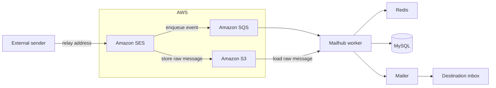

<p align="center">
  
</p>

<h1 align="center">Mailhub</h1>

<p align="center">
  A privacy-first email relay that keeps your real address out of third-party services.
</p>

<p align="center">
  <a href="https://private-mailhub.com">Try Mailhub</a> ·
  <a href="https://github.com/youngjinmo/mailhub/releases">Releases</a> ·
  <a href="https://github.com/youngjinmo/mailhub/issues">Issues</a>
</p>

<p align="center">
  
  = 20" />
  
  
  <a href="LICENSE"></a>
</p>

Mailhub creates private relay addresses such as `shop.7x9k@private-mailhub.com`. Use a different
address for each service, receive the messages in your real inbox, and disable an address whenever
it starts receiving unwanted mail.

## Contents

- [Features](#features)
- [Screenshots](#screenshots)
- [How it works](#how-it-works)
- [Architecture](#architecture)
- [Tech stack](#tech-stack)
- [Self-hosting](#self-hosting)
- [Useful commands](#useful-commands)
- [Production deployment](#production-deployment)
- [Security](#security)
- [Roadmap](#roadmap)
- [Contributing](#contributing)
- [License](#license)

## Features

- **Relay addresses** — Create random or custom addresses for shopping, newsletters, sign-ups, and
  other services.
- **One-click control** — Add a label, copy an address, and turn forwarding on or off at any time.
- **Reply masking** — Reply to forwarded messages without exposing your primary address.
- **Flexible sign-in** — Use email verification or connect GitHub and Google OAuth.
- **Free tier** — Create up to 20 relay addresses on the current free tier.
- **Application-layer encryption** — Primary addresses and reply-routing values are stored as
  AES-256-GCM ciphertext. See [Security](#security) for the current key-management limitation.

## Screenshots

<p align="center">
  
</p>

## How it works

1. **Sign in** and choose an email verification code or an OAuth provider.
2. **Create a relay address** for the service you are using.
3. **Use the relay address** instead of your real email address.
4. **Receive messages normally** in your inbox. If the address becomes noisy, disable it without
   changing your primary email.

## Architecture

Mailhub separates the web application from the email worker. AWS services receive and queue inbound
mail, while the worker resolves the relay address and sends the message to the destination inbox.



### Email processing pipeline

| Step | Component | Responsibility |
| --- | --- | --- |
| 1 | Amazon SES | Receives mail for the configured relay domain. |
| 2 | Amazon S3 | Stores the raw MIME message. Configure S3 encryption and retention outside this repository. |
| 3 | Amazon SQS | Queues the S3 event for asynchronous processing. |
| 4 | Mailhub worker | Polls SQS, loads the message, and resolves the relay address. |
| 5 | Redis and MySQL | Cache and persist relay/account lookups. |
| 6 | Mailgun or SES | Forwards the processed message to the destination inbox. |

## Tech stack

| Area | Technology |
| --- | --- |
| Frontend | React, TypeScript, Vite, Tailwind CSS |
| Backend | Node.js, TypeScript, NestJS |
| Database | MySQL-compatible database through TypeORM |
| Cache | Redis |
| Inbound email | Amazon SES, S3, SQS |
| Outbound email | Mailgun in production, Amazon SES in other environments |
| Deployment | Nginx and PM2 |
| License | AGPL-3.0 |

## Self-hosting

The repository contains two independent Node.js applications. There is no root `package.json`, so
install and run dependencies from `back-end` and `front-end` separately.

This repository does not provision AWS or DNS resources. Before running a worker, configure a SES
receipt rule that stores mail in S3, an S3 event notification to SQS, IAM permissions for the worker,
and DNS/verified sending identities for the relay domain. Configure S3 encryption, retention, and
access policies in AWS; the application only reads the resulting SQS event and S3 object.

### Prerequisites

- Node.js 20 or newer and npm
- MySQL 8+ or another MySQL-compatible database
- Redis 7+
- AWS account with SES, S3, and SQS configured for the relay domain
- Mailgun account for production outbound mail
- DNS access for the relay domain

OAuth providers are optional. Add GitHub and/or Google credentials only when you enable the matching
sign-in option. The backend has an Apple OAuth endpoint, but the current web UI does not expose an
Apple sign-in control.

### 1. Clone and install

```bash
git clone https://github.com/youngjinmo/mailhub.git
cd mailhub

npm --prefix back-end ci
npm --prefix front-end ci
```

### 2. Configure the environment

Copy the checked-in examples and replace every placeholder before starting the backend:

```bash
cp back-end/.env.example back-end/.env
cp front-end/.env.example front-end/.env
```

Generate a 32-byte Base64 value for `ENCRYPTION_KEY`:

```bash
openssl rand -base64 32
```

The current browser client requires the same value in `back-end/.env` as `ENCRYPTION_KEY` and in
`front-end/.env` as `VITE_ENCRYPTION_KEY`. Vite exposes `VITE_*` values in the browser bundle, so
this value is an implementation compatibility value, not a server-only secret. Never put a JWT,
AWS, Mailgun, OAuth, or other server secret in a `VITE_*` variable. Keep server-only values in a
secrets manager and never commit `.env` files.

The most important settings are:

| File | Variable | Example or note |
| --- | --- | --- |
| `back-end/.env` | `APP_NAME`, `APP_DOMAIN`, `PORT`, `CORS_ORIGINS` | Application identity, relay domain, listener, and allowed browser origins. |
| `back-end/.env` | `DATABASE_HOST`, `DATABASE_PORT`, `DATABASE_NAME`, `DATABASE_USERNAME`, `DATABASE_PASSWORD` | Database connection. |
| `back-end/.env` | `REDIS_HOST`, `REDIS_PORT`, `REDIS_TTL` | Redis connection and cache lifetime. |
| `back-end/.env` | `JWT_SECRET`, `ENCRYPTION_KEY` | Server configuration; `ENCRYPTION_KEY` must decode to 32 bytes. |
| `back-end/.env` | `AWS_ACCESS_KEY_ID`, `AWS_SECRET_ACCESS_KEY`, `AWS_REGION`, `AWS_S3_EMAIL_BUCKET`, `AWS_SQS_QUEUE_NAME`, `AWS_SQS_QUEUE_URL` | AWS SDK configuration used by the mail path and worker. |
| `back-end/.env` | `NO_REPLY_ADDRESS`, `CONTACT_ADDRESS` | Service and support addresses. |
| `back-end/.env` | `MAILGUN_API_KEY`, `MAILGUN_BASE_URL` | Valid Mailgun settings are required to send production mail. |
| `back-end/.env` | `GITHUB_CLIENT_ID`, `GITHUB_CLIENT_SECRET`, `GOOGLE_CLIENT_ID`, `GOOGLE_CLIENT_SECRET` | Optional; required only for the corresponding web OAuth flow. |
| `back-end/.env` | `APPLE_CLIENT_ID` | Used by the backend Apple OAuth endpoint; the current web UI does not expose that flow. |
| `front-end/.env` | `VITE_API_URL` | Local default: `http://localhost:8080`. Do not append `/api`. |
| `front-end/.env` | `VITE_ENCRYPTION_KEY` | Must match the backend value, but is visible to browser users. |

The backend validates its core startup configuration. See the two `.env.example` files for the
complete list; optional OAuth settings are read only when their corresponding flow is used.

### 3. Initialize the database

There is no verified fresh-database bootstrap at this revision. Do not use
`scripts/init-db.sql` for a new production installation: it does not match the current entities.
The checked-in migration chain also assumes an older schema, including historical foreign-key and
index names, so it is not a safe replacement for the bootstrap script.

Use a schema baseline that you have validated against this revision before starting a new deployment.
For an existing installation, back up the database and validate the target schema in a disposable
environment before running `npm --prefix back-end run migration:run`.

### 4. Start the applications

Start the backend and frontend in separate terminals:

```bash
# Terminal 1: API server
npm --prefix back-end run start:dev
```

```bash
# Terminal 2: Vite development server
npm --prefix front-end run start
```

Open [http://localhost:3000](http://localhost:3000). The API is available at
[http://localhost:8080/api](http://localhost:8080/api).

To run the SQS worker locally, start a second backend process with worker mode enabled. It requires
the AWS S3/SQS resources to be configured:

```bash
WORKER_MODE=true npm --prefix back-end run start:dev
```

## Useful commands

### Backend

| Command | Purpose |
| --- | --- |
| `npm --prefix back-end run start:dev` | Start the API in watch mode. |
| `npm --prefix back-end run build` | Build the backend and run its formatting/lint steps. |
| `npm --prefix back-end run test` | Run unit tests. |
| `npm --prefix back-end run test:e2e` | Run end-to-end tests. |
| `npm --prefix back-end run migration:run` | Apply pending TypeORM migrations. |
| `npm --prefix back-end run migration:revert` | Revert the latest migration. |

### Frontend

| Command | Purpose |
| --- | --- |
| `npm --prefix front-end run start` | Start the Vite development server. |
| `npm --prefix front-end run build:prod` | Create a production frontend build. |
| `npm --prefix front-end run lint` | Check frontend lint rules. |
| `npm --prefix front-end run preview` | Preview the production build locally. |

## Production deployment

The repository includes starting-point templates for [PM2](ecosystem.config.js) and
[Nginx](nginx.config.mjs). They are not turnkey deployment automation. In particular, correct the
uncommented `HTTPS server` text in the Nginx template before copying it, then run `nginx -t` on the
target host. Before using either template:

1. Update their absolute paths and domain names for your server.
2. Provision MySQL, Redis, AWS SES/S3/SQS, Mailgun, DNS, and TLS.
3. Build both applications:

   ```bash
   npm --prefix back-end run build
   npm --prefix front-end run build:prod
   ```

4. Run one PM2 process with `WORKER_MODE=false` for the API and one with `WORKER_MODE=true` for the
   SQS worker.
5. Configure Nginx to serve `front-end/dist` and proxy `/api` to port `8080`, then validate the
   rendered Nginx configuration before reloading it.

Set `NODE_ENV=production` to use Mailgun for outbound email. In development and other non-production
environments, the mail service uses Amazon SES instead.

## Security

- Primary email addresses and reply-routing values are encrypted with AES-256-GCM before database or
  cache storage.
- `VITE_ENCRYPTION_KEY` is intentionally available to the browser bundle in the current design. It
  can reduce accidental plaintext exposure in application storage, but it is not protection against
  a browser-bundle or key compromise. Do not describe it as a server-only encryption secret.
- Use a separate, randomly generated `JWT_SECRET` per environment. Treat AWS, Mailgun, and OAuth
  credentials as server-only secrets.
- Grant AWS and Mailgun credentials only the permissions required by the deployment.
- Do not commit `.env` files, private keys, API keys, or production data.

To report a vulnerability, please do not open a public issue. Email
[contact@private-mail.com](mailto:contact@private-mail.com) instead.

## Roadmap

- [ ] Improve reply-relay handling and sender privacy
- [ ] Move the email worker to AWS Lambda for cost efficiency
- [ ] Add AI-powered email summarization
- [ ] Add browser extension and mobile apps

## Contributing

Issues and pull requests are welcome. Before opening a pull request:

1. Keep changes focused and explain the user-visible impact.
2. Run the relevant backend tests and frontend lint/build commands.
3. Never include secrets or real email addresses in commits, tests, or screenshots.

For security vulnerabilities, use the private reporting channel above instead of a public issue.

## License

Mailhub is licensed under the [GNU Affero General Public License v3.0](LICENSE).
